<!-- Please do not change this logo with link -->

# I3C Multi-Sensor Integration using the PIC18F16Q20 Microcontroller with MCC Melody

<!-- This is where the introduction to the example goes, including mentioning the peripherals used -->
This code example demonstrates a use-case for the I3C module on the PIC18F16Q20, acting as an interface between the I3C bus and two analog temperature sensors.  The ADC configurations for each sensor can be configured by sending messages to the Q20 through I3C. The ADC results for each analog sensor are sampled every second and can be accessed through I3C messages to the Q20.  In addition, when the ADC threshold is configured, it triggers an In-Band Interrupt (IBI) message to the I3C bus indicating which sensor triggered the threshold and the ADC value that triggered it.  
## Related Documentation

<!-- Any information about an application note or tech brief can be linked here. Use unbreakable links!
     In addition a link to the device family landing page and relevant peripheral pages as well:
     - [AN3381 - Brushless DC Fan Speed Control Using Temperature Input and Tachometer Feedback](https://microchip.com/00003381/)
     - [PIC18F-Q10 Family Product Page](https://www.microchip.com/design-centers/8-bit/pic-mcus/device-selection/pic18f-q10-product-family) -->
[PIC18F16Q20 Product Page](https://www.microchip.com/en-us/product/PIC18F16Q20)

## Software Used

<!-- All software used in this example must be listed here. Use unbreakable links!
     - MPLAB® X IDE 5.30 or newer [(microchip.com/mplab/mplab-x-ide)](http://www.microchip.com/mplab/mplab-x-ide)
     - MPLAB® XC8 2.10 or a newer compiler [(microchip.com/mplab/compilers)](http://www.microchip.com/mplab/compilers)
     - MPLAB® Code Configurator (MCC) 3.95.0 or newer [(microchip.com/mplab/mplab-code-configurator)](https://www.microchip.com/mplab/mplab-code-configurator)
     - MPLAB® Code Configurator (MCC) Device Libraries PIC10 / PIC12 / PIC16 / PIC18 MCUs [(microchip.com/mplab/mplab-code-configurator)](https://www.microchip.com/mplab/mplab-code-configurator)
     - Microchip PIC18F-Q Series Device Support (1.4.109) or newer [(packs.download.microchip.com/)](https://packs.download.microchip.com/) -->

- MPLAB X IDE 6.15.0 or newer [(MPLAB X IDE 6.15)](https://www.microchip.com/en-us/development-tools-tools-and-software/mplab-x-ide?utm_source=GitHub&utm_medium=TextLink&utm_campaign=MCU8_MMTCha_MPAE_Examples&utm_content=pic18f16q20-I3C-multi-sensor-integration-mplab-mcc-github)
- MPLAB XC8 2.45.0 or newer compiler [(MPLAB XC8 2.45)](https://www.microchip.com/en-us/development-tools-tools-and-software/mplab-xc-compilers?utm_source=GitHub&utm_medium=TextLink&utm_campaign=MCU8_MMTCha_MPAE_Examples&utm_content=pic18f16q20-I3C-multi-sensor-integration-mplab-mcc-github)
- MPLAB® Code Configurator (MCC) 5.3.7 or newer [(microchip.com/mplab/mplab-code-configurator)](https://www.microchip.com/mplab/mplab-code-configurator)
- MPLAB® Code Configurator (MCC) Device Libraries PIC10 / PIC12 / PIC16 / PIC18 MCUs [(microchip.com/mplab/mplab-code-configurator)](https://www.microchip.com/mplab/mplab-code-configurator)
- Microchip PIC18F-Q Series Device Support (1.20.405) or newer [(packs.download.microchip.com/)](https://packs.download.microchip.com/)
## Hardware Used

<!-- All hardware used in this example must be listed here. Use unbreakable links!
     - PIC18F47Q10 Curiosity Nano [(DM182029)](https://www.microchip.com/Developmenttools/ProductDetails/DM182029)
     - Curiosity Nano Base for Click boards™ [(AC164162)](https://www.microchip.com/Developmenttools/ProductDetails/AC164162)
     - POT Click board™ [(MIKROE-3402)](https://www.mikroe.com/pot-click) -->
- The PIC18F16Q20 Curiosity Nano is used as a test platform
- Curiosity Nano Base for Click boards [(AC164162)](https://www.microchip.com/Developmenttools/ProductDetails/AC164162)
- 2x[Thermo 16 Click boards™](https://www.mikroe.com/thermo-16-click)(mikroBUS™ sockets 1 and 2)
 
## Setup

<!-- Explain how to connect hardware and set up software. Depending on complexity, step-by-step instructions and/or tables and/or images can be used -->
The following configurations must be made for this project:
- Clock Control:
    - Clock Source: HFINTOSC
    - HF Internal Clock: 64 MHz
    - Clock Divider: 1
 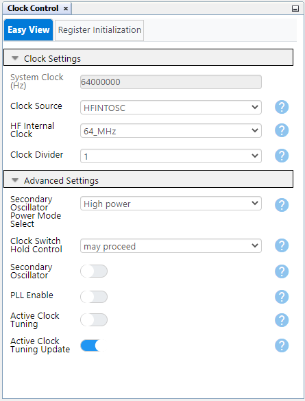
- Configuration bits:
    - WDT operating mode: WDT disabled 
 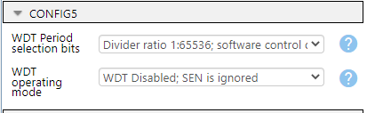
- Interrupt Manager: Single ISR Execution per entry:
 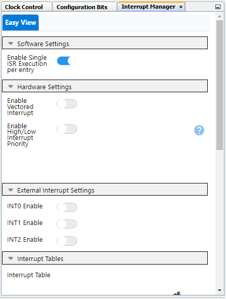
- ADCC:
    - Most intial ADCC settings are irrelevant as they will be overwritten during runtime, important setting is using ADCRC as clock source
 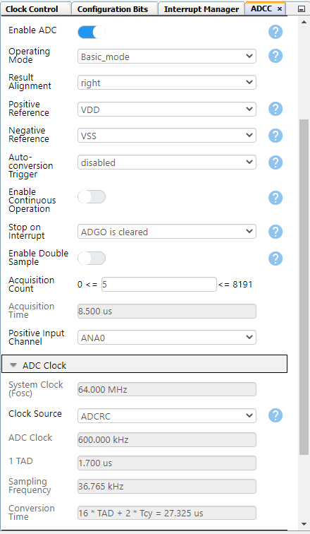
- TMR1:
    - LFINTOSC clock source, 1 second period
 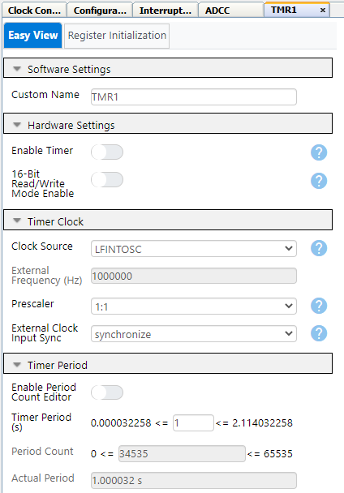
    - Timer Interrupt Enabled
 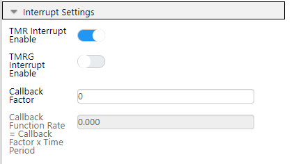
- I3C:
    - Static Address: 0x30
    - Device ID: 0xC6
    - MIPI Manufacturer 0x034D
    - All other IDs 0x0
 
    - Speed Limited 12.5MHz, max read turnaround time of 5μs
    - Ensure "Hot Join-Capable" is disabled
 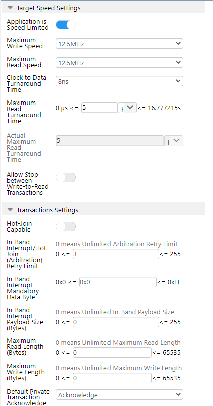
- I3CPLIB
    - Enable Module
    - Clock source HFINTOSC, enable interrupts
  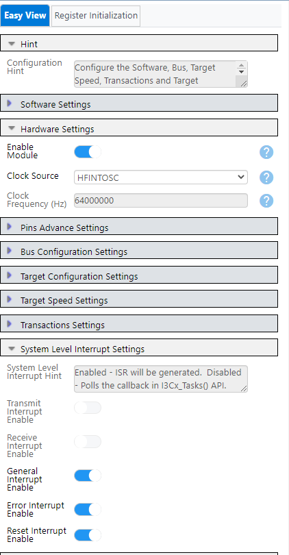
    - Transaction Complete Interrupt Enable
  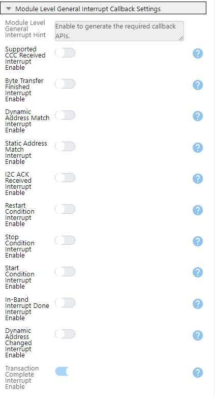

| Pin | Configuration  |        Description        |
| :-: | :------------: | :-----------------------: |
| RA2 |  Analog input  |          Sensor 1         |
| RB7 |  Analog input  |          Sensor 2         |
| RC0 | Digital input  |          I3C SCL          |
| RC1 | Digital in/out |          I3C SDA          |

 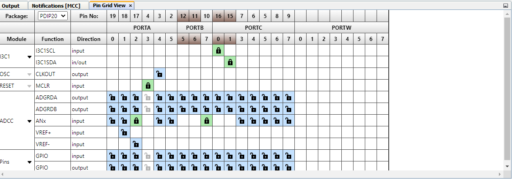

## Operation
<!-- Explain how to operate the example. Depending on complexity, step-by-step instructions and/or tables and/or images can be used -->
Once set up and programmed, the PIC18F16Q20 nano SDA and SCL pins need to be connected to an I3C compatible host. The host needs to send an "Enter Dynamic Address Assignment" (ENTDAA) command to the bus to assign a dynamic address to the PIC18F16Q20 device:
 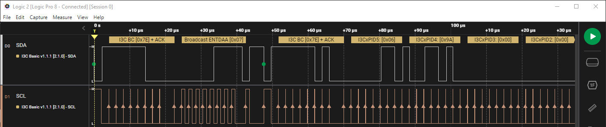
 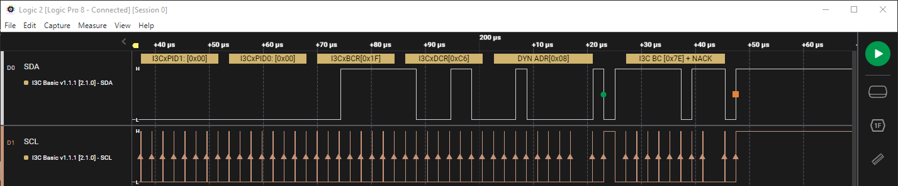
 
Once complete, the ADC configuration and results registers can be accessed through I3C via private reads/writes. The first byte sent determines the address (index) of the register to be accessed.  If only one byte is sent, the PIC18F16Q20 will respond with the value stored in that index.  
 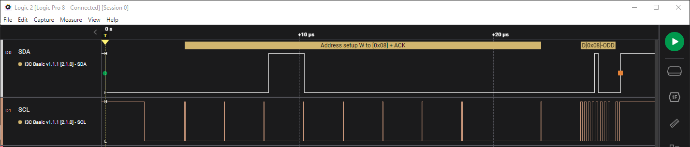
 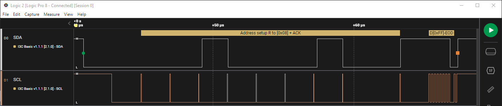
 
If two bytes are sent, the value in the second byte will be written to that index.
 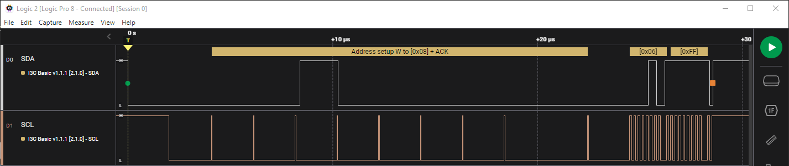
 
The addresses of each configuration/result register are as follows:

Sensor 1:

| Address | Register |
| :-----: | :------: |
|  0x00   | ADCON0   | 
|  0x01   | ADCON1   |
|  0x02   | ADCON3   |
|  0x03   | ADSTAT   |
|  0x04   | ADLTHL   |
|  0x05   | ADLTHH   |
|  0x06   | ADUTHL   |
|  0x07   | ADUTHH   |
|  0x08   | ADRESL   |
|  0x09   | ADRESH   |

Sensor 2:

| Address | Register |
| :-----: | :------: |
|  0x10   | ADCON0   | 
|  0x11   | ADCON1   |
|  0x12   | ADCON3   |
|  0x13   | ADSTAT   |
|  0x14   | ADLTHL   |
|  0x15   | ADLTHH   |
|  0x16   | ADUTHL   |
|  0x17   | ADUTHH   |
|  0x18   | ADRESL   |
|  0x19   | ADRESH   |

Once per second, the configuration values are loaded for each sensor from these addresses, a conversion is completed, and the results are loaded from the ADCC to the address accessed by the I3C code.    
Finally, if the threshold interrupt is configured (through modifying the threshold and ADCON3 registers) and triggers, the device will send an In-Band Interrupt (IBI) with four bytes of data: The mandatory byte (0x00), the sensor that triggered the IBI (1 or 2) and the current ADC value of the sensor.
 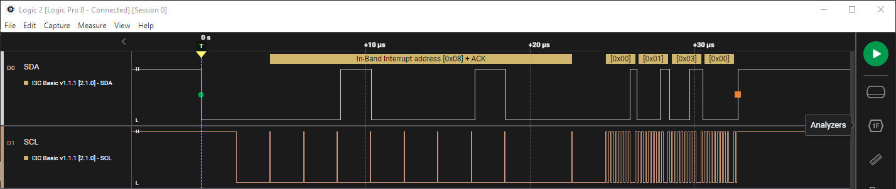
## Summary

This code example shows how to configure a PIC18F16Q20 as an interface with two analog sensors over the I3C bus.

## How to Program the Curiosity Nano Board

This chapter demonstrates how to use the MPLAB X IDE to program a PIC® device with an `Example_Project.X`. This is applicable to other projects.

1.  Connect the board to the PC.

2.  Open the `Example_Project.X` project in MPLAB X IDE.

3.  Set the `Example_Project.X` project as main project.
     Right click the project in the **Projects** tab and click Set as Main Project.
     

4.  Clean and build the `Example_Project.X` project.
     Right click the `Example_Project.X` project and select Clean and Build.
     

5.  Select PICxxxxx Curiosity Nano in the Connected Hardware Tool section of the project settings:
     Right click the project and click Properties.
     Click the arrow under the Connected Hardware Tool.
     Select PICxxxxx Curiosity Nano (click the SN), click **Apply** and then **OK**:
     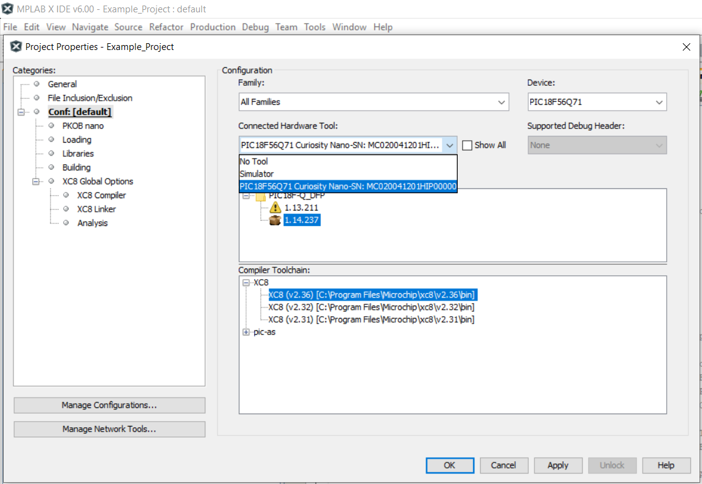

6.  Program the project to the board.
     Right click the project and then Make and Program Device.
     
